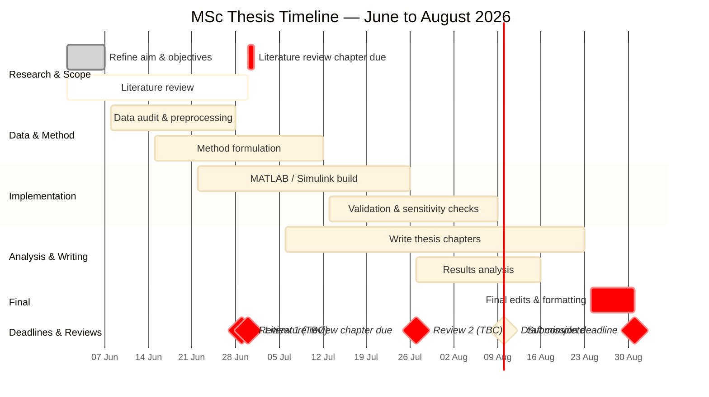

# MSc Motorsport Engineering — Thesis Timeline

**Cranfield University | Individual Research Project A25**  
**Topic:** Telemetry-Driven Tyre Thermal & Cold Pressure Recommendation Model for GT3 Motorsport  
**Period:** 1 June 2026 → 31 August 2026

---

## 📅 Gantt Chart

---

## 📋 Task Summary

| # | Task | Start | End | Duration | Section |
|---|------|-------|-----|----------|---------|
| 1 | Refine aim & objectives | 01 Jun | 07 Jun | 7 days | Research & Scope |
| 2 | Literature review | 01 Jun | 30 Jun | 30 days | Research & Scope |
| 3 | Data audit & preprocessing | 08 Jun | 28 Jun | 21 days | Data & Method |
| 4 | Method formulation | 15 Jun | 12 Jul | 28 days | Data & Method |
| 5 | MATLAB / Simulink build | 22 Jun | 26 Jul | 35 days | Implementation |
| 6 | Validation & sensitivity checks | 13 Jul | 09 Aug | 28 days | Implementation |
| 7 | Results analysis | 27 Jul | 16 Aug | 21 days | Analysis & Writing |
| 8 | Write thesis chapters | 06 Jul | 23 Aug | 49 days | Analysis & Writing |
| 9 | Final edits & formatting | 24 Aug | 31 Aug | 8 days | Final |

---

## 🔖 Key Deadlines & Reviews

| Event | Date | Notes |
|-------|------|-------|
| 🔴 Literature review chapter due | 30 Jun 2026 | Chapter submitted before end of June |
| 🟡 Review 1 | 29 Jun 2026 | TBC — supervisor progress check |
| 🟡 Review 2 | 27 Jul 2026 | TBC — 4 weeks after Review 1 |
| 🟠 Draft complete | 10 Aug 2026 | Full draft ready for supervisor review |
| 🔴 Submission deadline | 31 Aug 2026 | Final thesis submitted |

---

## 📁 Project Context

- **Vehicle:** Porsche 992.1 GT3 Cup
- **Tool:** MATLAB / Simulink tyre thermal model
- **Data source:** AiM RaceStudio 3 telemetry export (.mat)
- **Model:** Two-node tyre thermal model (tread + carcass) linked to gas-law pressure prediction
- **Output:** Four-corner cold tyre pressure recommendations (FL, FR, RL, RR)

---

*Last updated: June 2026*
